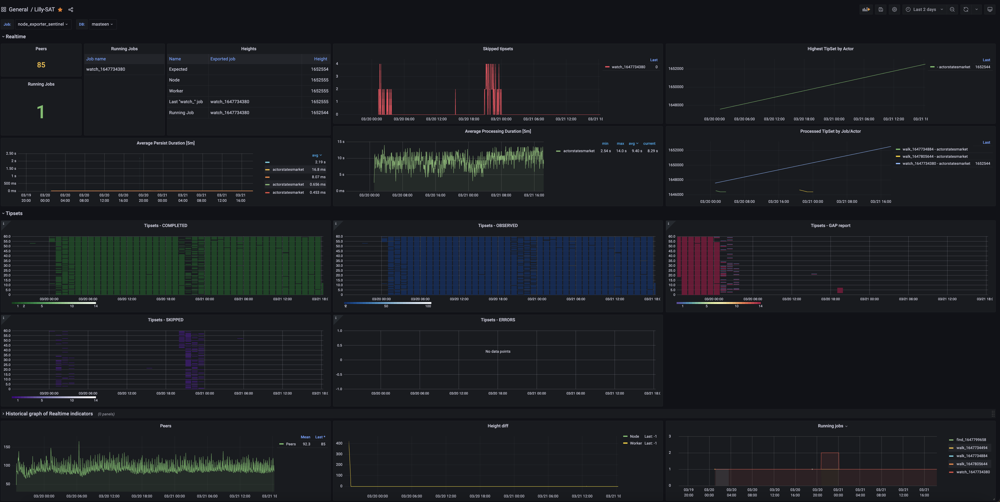

# lily-sat
Dashboard for [Lily](https://github.com/filecoin-project/lily) Filecoin chain indexer

## Requirements :
  - A prometheus server consuming Lily APIs
  - A read-only Postgresql connection to Lily TimescaleDB.
  - Grafana 8.1.2 (might work with other versions)

## Installation
1. Import the dashboard 
2. Select both datasources from the Top menu

## Thanks
To all the great team developping lily. 
